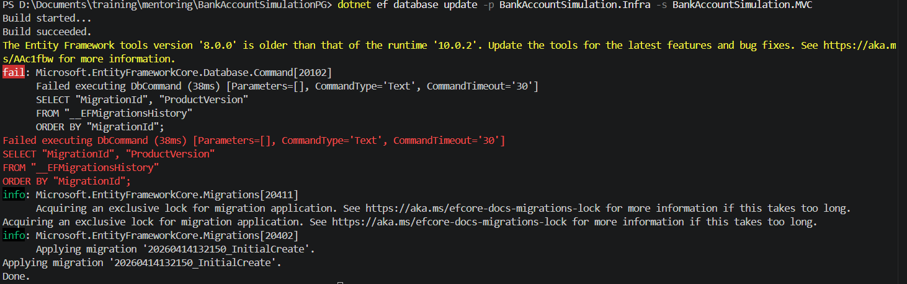

# 🚀 Project Execution Guide: BankAccountSimulation

This guide provides step-by-step instructions to set up, migrate, and run the BankAccountSimulation project from the root directory.

---

## 1. Prerequisites
* **.NET 10.0 SDK** (or the latest version installed on your machine).
* **PostgreSQL Instance**: Ensure a database is created and accessible.
* **EF Core Tools**: Install globally via:
  `dotnet tool install --global dotnet-ef`

---

## 2. Database Configuration
Before launching, update the connection string in the following file:
`BankAccountSimulation.MVC/appsettings.Development.json`

Ensure it points to your local PostgreSQL instance:
```json
"ConnectionStrings": {
  "DefaultConnection": "Host=localhost; Port=5432; Database=public; Username=postgres; Password=postgres"
}
```
## 3. Deployment Steps (From Project Root)
Open your terminal in the folder containing the .sln file and execute the following commands:

#### Step 1: Apply Database Migrations
This command creates the necessary tables, indexes, and constraints in your PostgreSQL database:
```bash
dotnet ef database update -p BankAccountSimulation.Infra -s BankAccountSimulation.MVC
```
<b>Don't worry if the message is like this, it's just ef core's pre-check:</b>




### Step 2: Launch the Application
Start the MVC web interface:

```bash
dotnet run --project BankAccountSimulation.MVC
```

## 4. Testing & Code Coverage
### Step 1: Prerequisites for Testing
To generate visual coverage reports, ensure you have the ReportGenerator tool installed:

```bash
dotnet tool install --global dotnet-reportgenerator-globaltool
```
### Step 2: Running Unit Tests
To execute all test suites and view the results directly in your terminal, run:

```bash
dotnet test
```
### Step 3: Generating Coverage Reports (HTML)
To generate a detailed line-by-line coverage report (similar to the one provided in the documentation), follow these two steps:

#### Run tests and collect coverage data

```bash
dotnet test --collect:"XPlat Code Coverage"
```
#### Transform the raw data into a readable HTML report
<b>(Note: Replace the path to the coverage.cobertura.xml file with the actual path generated in your TestResults folder)</b>

```bash
reportgenerator "-reports:BankAccountSimulation.Test\TestResults\**\coverage.cobertura.xml" "-targetdir:coveragereport" -reporttypes:Html
```
Once completed, open file `coveragereport/index.html` in your preferred web browser.

### 5. Testing Standards & Quality Assurance
To maintain high-quality code, all unit tests follow these strict principles:

- **Isolation (AAA Pattern):** Every test case follows the Arrange-Act-Assert pattern. Dependencies are isolated using Mocks to ensure that tests do not fail due to external factors.

Targeted Scope:

- Service Layer: Focuses on business rules, transaction integrity, and repository interactions.

- Controller Layer: Focuses on request handling, ModelState management, and proper Action results (Redirect/View).

Mocking Strategy:

- Mock<IUnitOfWork>: Simulates database transactions without requiring a live PostgreSQL instance.

- Mock<IValidator<T>>: Injected into controllers to simulate various validation scenarios (Success/Failure) independently of the actual validation rules.

- MockAuthService: Simulates identity claims and authentication cookies for testing protected routes.

**Coverage Benchmark:** The project maintains a minimum coverage of 75% for both Service and Controller layers to ensure all critical execution paths are verified.